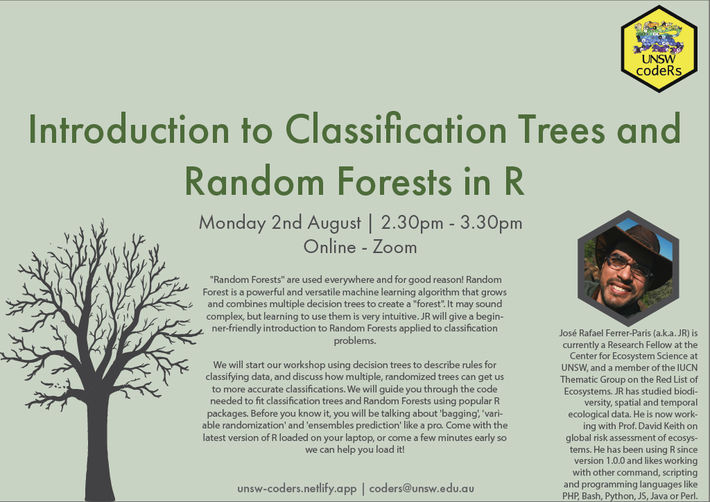

## Resources created by JR

[This GitHub repository](https://github.com/UNSW-codeRs/workshop-random-forests)! contains all the material discussed in the workshop and will help you follow the recording. This includes a short presentation on using decision trees to describe rules for classifying data, and how multiple, randomized trees can get us to more accurate classifications. Then two R-markdown document are available to guide you through the code needed to fit classification trees and Random Forests using popular R packages.

## Additional Resources

- Davis David: Random Forest Classifier Tutorial - [How to Use Tree-Based Algorithms for Machine Learning](https://www.freecodecamp.org/news/how-to-use-the-tree-based-algorithm-for-machine-learning/)
- Evan Muzzall and Chris Kennedy: [Introduction to Machine Learning in R](https://dlab-berkeley.github.io/Machine-Learning-in-R/slides.html)
- Github link: [Machine Learning in R](https://github.com/dlab-berkeley/Machine-Learning-in-R)
- Github link: [Machine Learning with Tidymodels](https://github.com/dlab-berkeley/Machine-Learning-with-tidymodels)
- Dave Tang: [Building a classification tree in R](https://davetang.org/muse/2013/03/12/building-a-classification-tree-in-r)
- Zach @ Statology: [How to Fit Classification and Regression Trees in R](https://www.statology.org/classification-and-regression-trees-in-r/)
- Ben Gorman: [Decision Trees in R using rpart](https://www.gormanalysis.com/blog/decision-trees-in-r-using-rpart/)
- Victor Zhou: [Random Forests for Complete Beginners](https://victorzhou.com/blog/intro-to-random-forests/)
- Bradley Boehmke & Brandon Greenwell: [Hands-On Machine Learning with R](https://bradleyboehmke.github.io/HOML/random-forest.html)
- Julia Kho: [Why Random Forest is My Favorite Machine Learning Model](https://towardsdatascience.com/why-random-forest-is-my-favorite-machine-learning-model-b97651fa3706)
- JanBask: [Training A Practical guide to implementing Random Forest in R with example](https://www.janbasktraining.com/blog/random-forest-in-r/)
