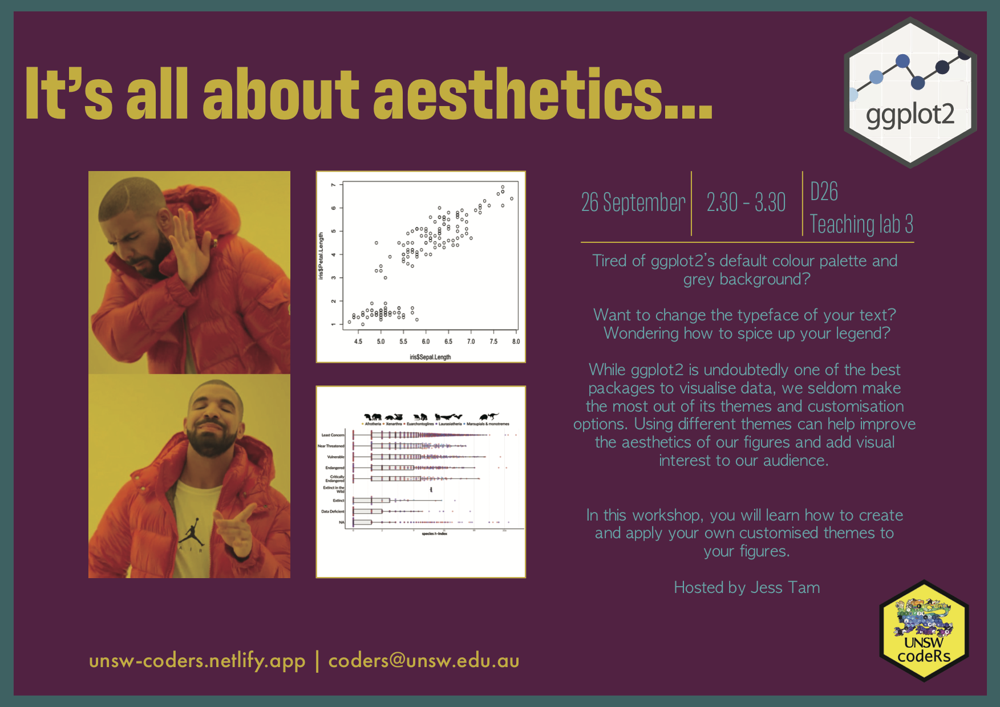

---
date: '2022-26-09'
title: "Data Visualization - ggplot themes in R" 
links:
# - icon: video
#   # icon_pack: fas
#   #name: Workshop Recording 
#   #url: https://drive.google.com/drive/u/4/folders/15lQKQz24BVm3kuR466BWyS4sWpeg9uDm
- icon: github
  icon_pack: fab
  name: github Material
  # name: 
  url: https://github.com/UNSW-codeRs/dataviz_ggplot2_themes
---  
Workshop description: Tired of ggplot2’s default colour palette and grey background? Want to change the typeface of your text? Wondering how to spice up your legend? While ggplot2 is undoubtedly one of the best packages to visualise data, we seldom make the most out of its themes and customisation options. Using different themes can help improve the aesthetics of our figures and add visual interest to our audience. In this workshop, you will learn how to create and apply your own customised themes to your figures.

Presenter Bio: Jess is a PhD candidate at UNSW, Sydney. Their project focuses on using artificial intelligence to automatically classify species of animals in camera trap images, and track their behaviour with video recordings.

