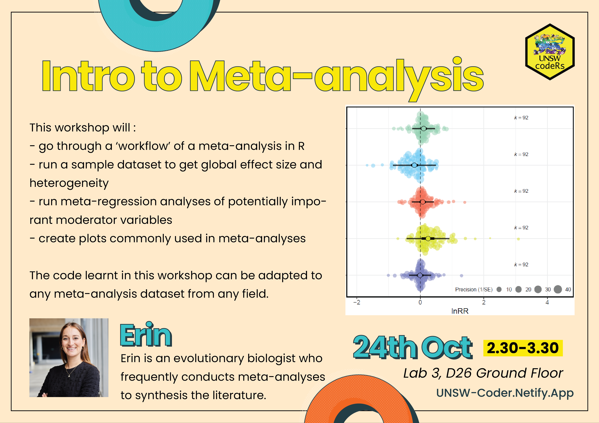

## Presenter bio:
Erin is an evolutionary biologist in the Inter-Disciplinary Ecology and Evolution Lab working with Prof Shinichi Nakagawa. She frequently conducts meta-analyses to synthesise the literature and address hypotheses related to evolutionary ecology. She has also dabbled in other disciplines including psychology and climate change. 

