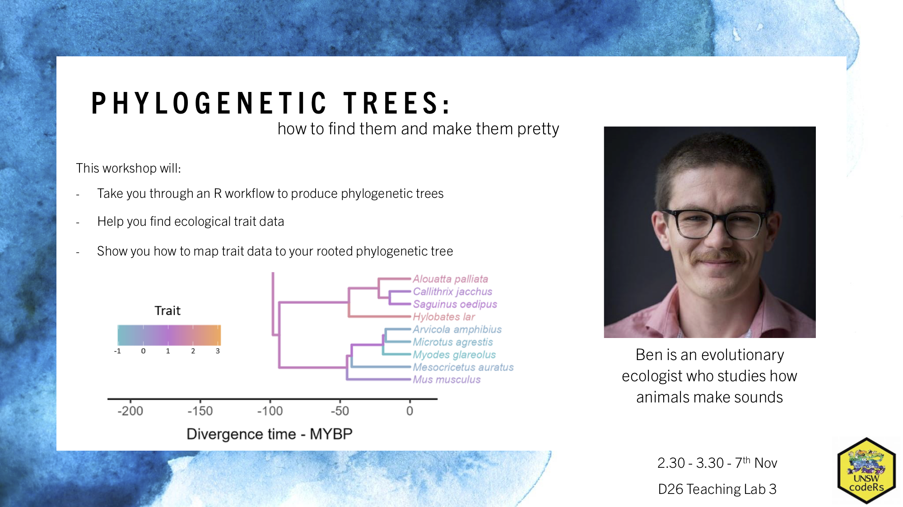

This workshop will:

- take you through an R workflow to produce phylogenetic trees with rooted tree branch lengths
- help you find ecological trait data
- show you how to map that trait data to your rooted phylogenetic tree

The code you'll learn can be used for producing many types of phylogenetic trees, with any numerical species trait

Presenter: PhD candidate Ben Walker

Presenter Bio: Ben is an evolutionary ecologist who studies how animals make sounds
