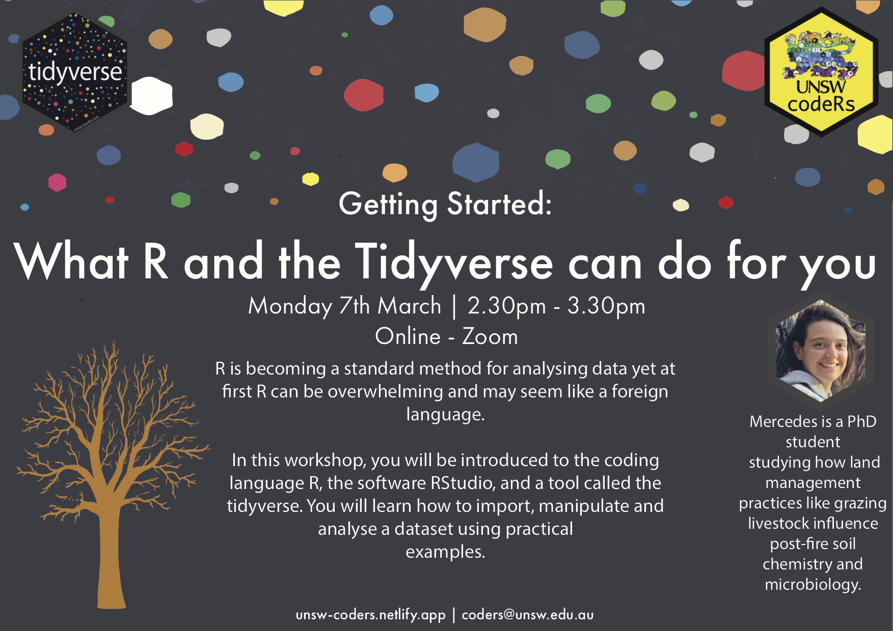

---
header:
  caption: ""
  image: ""
title: 
view: 2
---

 Due to the current COVID situation, future workshop will be completely online for now. If you wish to attend, please sign up (see the Sign Up tab in the navigation bar) and we will send you a Zoom link prior to the event. Looking forward to see you all there!

# Upcoming Workshops:

<h2> - 30th August: What R and the Tidyverse can do for you </h2>

<h2> - 11th October: Data Visualisation </h2>
<h2> - 1st November: Git 101 </h2>

# Past Workshops & Resources:
