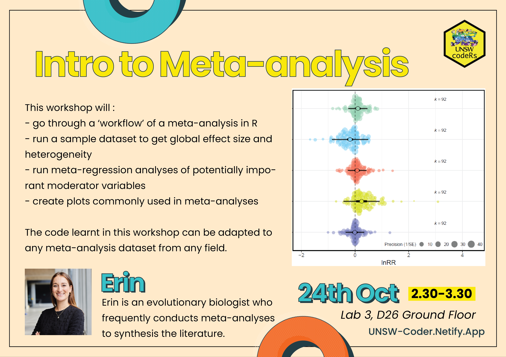

---
header:
  caption: ""
  image: ""
title: 
view: 2
output: 
  html_document: default
    code_folding:hide
---
# Drop-In Sessions:

Frustrated with R? Have a problem with your code? Just want help getting started? Come to our relaxed IN PERSON drop-in help sessions where you can sit down with a seasoned R coder and get personal one-on-one help. We all started somewhere, and we know how hard it can be! No registration required, and all are welcome. Feel free to also come along and contribute by helping others in the community!

# Upcoming Workshops:
<!-- 
<strong> We have had to postpone our August workshop on ggplot until next term (details to follow very soon!). Instead, we will still be available on Monday for a drop-in help session - details below.</strong>
 --> 

<strong>Location: [Teaching Lab 3 (Skeleton Lab)](https://studentvip.com.au/unsw/kensington/maps/134111) in Building D26, Ground floor 
Time: 2:30 - 3:30pm </strong>

# Past Workshops & Resources:
