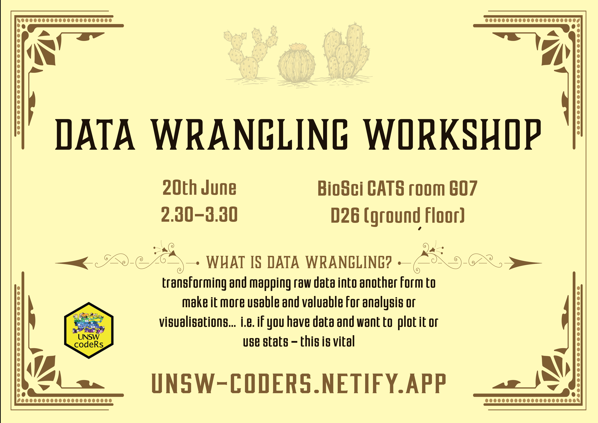

---
header:
  caption: ""
  image: ""
title: 
view: 2
---

# Upcoming Workshops:

<!--  --> 

#### Presenter bio:

How do hyper-diverse communities of plants emerge and seemingly persist without driving each other to extinction? This is the question that motivates my recent research, from my PhD at the University of Queensland where I studied tiny annual wildflowers in the Western Australian wheatbelt, to my postdoc at UNSW where I am investigating how colossal eucalypts communities will respond to climate change. Data wrangling, computer programming and statistical analysis have been critical tools in addressing my research questions, and I am excited to share these tools with you!

# Past Workshops & Resources:
