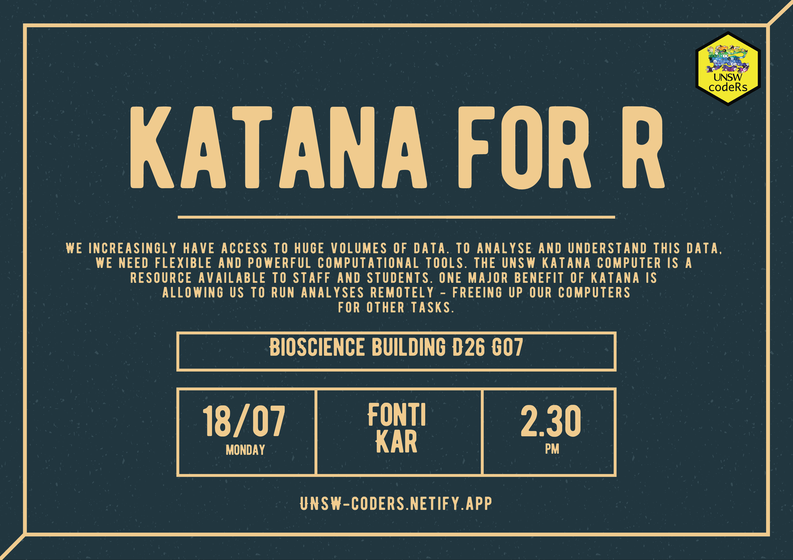

---
header:
  caption: ""
  image: ""
title: 
view: 2
---

# Upcoming Workshops:

<!--  --> 

We live in a data-driven era, where collecting large amounts of information is becoming increasingly more accessible. There is now an unprecedented demand for more flexible and powerful computational tools in order to understand our data. The UNSW Katana computer cluster fulfils this criteria by providing student and staff computational resources to aid their research. One major benefit of Katana is the ability for users to run their computationally heavy analyses remotely - this frees up their own computer for other tasks. While Katana has been described as 'easy to access', the initial learning curve can be daunting. In this workshop, I will guide attendees on how to getting started with Katana and how to run analyses on it. I will focus on the application of Katana in the context of 'R' analyses, however there over 100 different software available for users to explore. I hope attendees can walk away from this workshop feeling more confident and equipped to use this untapped resource.

## Requirements:
This workshop assumes introductory level of R (installing/loading packages, reading/writing data, running own analyses and understanding of file paths, working directories). 

 Attendees must apply for an account to access Katana, please complete this a week prior to the workshop: 
 To apply for an account you can send an email to the 
<a href="mailto:ITServiceCentre@unsw.edu.au">UNSW IT Service Center</a> giving your zID, your role within UNSW and the name of your supervisor or head of your research group.

## Presenter bio:

Fonti is a postdoctoral research fellow at University of New South Wales, Sydney, Australia. She is an evolutionary biologist at heart but is currently working as an R package developer. Fonti works alongside researchers to develop R software tools for the research community. Her interests include biostatistics, reproducible science, learning about the latest coding practices and teaching others to enjoy using R. 

# Past Workshops & Resources:
